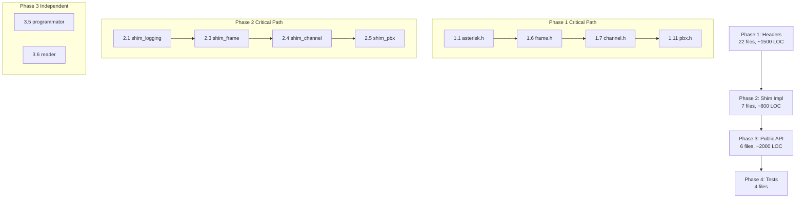

# Plan: asterisk-chan-simbox

> Version: 1.0
> Status: APPROVED
> Last Updated: 2026-08-21

## Implementation Strategy

**Approach**: Bottom-up, shim headers first → compile test → adapters → public API.

The plan is sequenced so that each task produces a testable artifact.
The critical path is: headers → compile → link → run.

---

## Task Breakdown

### Phase 1: Shim Headers (Trivial Layer)
*Goal: chan_svistok source compiles with `-I adapters/include/`*

| # | Task | Files | Complexity | Depends |
|---|------|-------|-----------|---------|
| 1.1 | Create `adapters/include/asterisk/asterisk.h` — master include, `ASTERISK_FILE_VERSION` no-op, version defines | 1 file | S | — |
| 1.2 | Create `asterisk/utils.h` — `ast_free`, `ast_malloc`, `ast_strdup`, `ast_strdupa`, `ast_alloca`, `ast_strlen_zero`, `ast_pthread_create_background` | 1 file | S | — |
| 1.3 | Create `asterisk/logger.h` — `ast_log`, `ast_verb`, `ast_debug`, `LOG_*` levels | 1 file | S | — |
| 1.4 | Create `asterisk/strings.h` — `ast_str`, `ast_str_buffer`, `ast_str_strlen` | 1 file | S | — |
| 1.5 | Create `asterisk/linkedlists.h` — `AST_LIST_*`, `AST_RWLIST_*` macros | 1 file | M | — |
| 1.6 | Create `asterisk/frame.h` — `struct ast_frame`, frame types, `AST_FRAME_*`, `ast_frfree`, `ast_frisolate` | 1 file | M | — |
| 1.7 | Create `asterisk/channel.h` — `struct ast_channel` (opaque), `struct ast_channel_tech`, accessors | 1 file | L | 1.6 |
| 1.8 | Create `asterisk/format_cap.h` — `ast_format_cap_*` stubs (SLINEAR-only) | 1 file | S | — |
| 1.9 | Create `asterisk/cli.h` — `struct ast_cli_entry`, `struct ast_cli_args`, `AST_CLI_DEFINE`, `ast_cli` | 1 file | M | — |
| 1.10 | Create `asterisk/module.h` — `AST_MODULE_INFO` no-op, `AST_MODFLAG_DEFAULT`, `ASTERISK_GPL_KEY` | 1 file | S | — |
| 1.11 | Create `asterisk/pbx.h` — `ast_pbx_start` stub, `pbx_builtin_setvar_helper` | 1 file | S | 1.7 |
| 1.12 | Create `asterisk/timing.h` — `ast_timer_*` types and function declarations | 1 file | S | — |
| 1.13 | Create `asterisk/causes.h` — `AST_CAUSE_*` constants | 1 file | S | — |
| 1.14 | Create `asterisk/callerid.h` — `AST_PRES_*` constants, `ast_callerid_parse` | 1 file | S | — |
| 1.15 | Create `asterisk/dsp.h` — DSP types for chan_svistok's own dsp.c | 1 file | M | 1.6 |
| 1.16 | Create `asterisk/config.h` — `ast_variable_browse` stub | 1 file | S | — |
| 1.17 | Create `asterisk/manager.h` — `ast_manager_register2`/`unregister` stubs | 1 file | S | — |
| 1.18 | Create `asterisk/musiconhold.h` — `ast_moh_start`/`stop` no-ops | 1 file | S | — |
| 1.19 | Create `asterisk/stringfields.h` — `AST_DECLARE_STRING_FIELDS` macros | 1 file | L | — |
| 1.20 | Create `asterisk/options.h`, `asterisk/ast_version.h`, `asterisk/ulaw.h`, `asterisk/alaw.h` — small stubs and lookup tables | 4 files | M | — |

**Phase 1 total**: 22+ header files, ~1500 lines estimated.
**Exit criteria**: `gcc -I adapters/include/ -fsyntax-only chan_svistok/*.c` compiles with zero errors.

---

### Phase 2: Shim Implementations (Real Logic)
*Goal: chan_svistok source links into a shared library*

| # | Task | Files | Complexity | Depends |
|---|------|-------|-----------|---------|
| 2.1 | Implement `shim_logging.c` — configurable log callback, default stderr routing | adapters/src/shim_logging.c | S | 1.3 |
| 2.2 | Implement `shim_timer.c` — `timerfd_create`/`timerfd_settime` wrappers for `ast_timer_*` | adapters/src/shim_timer.c | M | 1.12 |
| 2.3 | Implement `shim_frame.c` — `ast_frfree`, `ast_frisolate`, `ast_queue_frame` with consumer callback | adapters/src/shim_frame.c | M | 1.6 |
| 2.4 | Implement `shim_channel.c` — `ast_channel` lifecycle, accessors, channel variable storage, `ast_waitfor_n_fd` via `poll()` | adapters/src/shim_channel.c | L | 1.7, 2.3 |
| 2.5 | Implement `shim_pbx.c` — `ast_pbx_start` as event dispatch, `pbx_builtin_setvar_helper` key-value store | adapters/src/shim_pbx.c | M | 1.11, 2.4 |
| 2.6 | Implement `shim_cli.c` — `ast_cli` output routing, `ast_cli_register_multiple` storage | adapters/src/shim_cli.c | S | 1.9 |
| 2.7 | Implement `shim_callerid.c` — minimal `ast_callerid_parse` (~20 lines) | adapters/src/shim_callerid.c | S | 1.14 |
| 2.8 | Create `adapters/Makefile` — build all shim sources into `libsimbox_shim.a` | adapters/Makefile | M | 2.1–2.7 |

**Phase 2 total**: 7 .c files + Makefile, ~800 lines estimated.
**Exit criteria**: `chan_svistok/*.c` + `adapters/src/*.c` link into `libsimbox_shim.a` without undefined symbols.

---

### Phase 3: Public C API & Adapters
*Goal: `libsimbox.so` with clean FFI-ready API*

| # | Task | Files | Complexity | Depends |
|---|------|-------|-----------|---------|
| 3.1 | Create `src/simbox_types.h` — public enums, opaque handle types, event types | src/simbox_types.h | M | — |
| 3.2 | Create `src/simbox_api.h` — full public C API declaration (per spec §5) | src/simbox_api.h | M | 3.1 |
| 3.3 | Implement `src/simbox_modem.c` — modem driver adapter: init, device enumeration, calls, SMS, USSD, AT commands, event callback dispatch | src/simbox_modem.c | XL | 2.4, 2.5 |
| 3.4 | Implement `src/simbox_discovery.c` — discovery adapter wrapping adiscovery_core | src/simbox_discovery.c | L | 2.8 |
| 3.5 | Implement `src/simbox_programmator.c` — programmator adapter wrapping ttyprog_* | src/simbox_programmator.c | M | — |
| 3.6 | Implement `src/simbox_reader.c` — reader adapter wrapping reader_core | src/simbox_reader.c | M | — |
| 3.7 | Create `src/Makefile` — build `libsimbox.so` from all sources | src/Makefile | M | 3.3–3.6 |

**Phase 3 total**: 6 files + Makefile, ~2000 lines estimated.
**Exit criteria**: `libsimbox.so` exports all `simbox_*` symbols, loads without errors.

---

### Phase 4: Integration Testing
*Goal: Prove the shim works with a real modem*

| # | Task | Files | Complexity | Depends |
|---|------|-------|-----------|---------|
| 4.1 | Create `tests/test_compile.sh` — compile chan_svistok via both paths (real Asterisk headers vs shim) | tests/ | S | 2.8 |
| 4.2 | Create `tests/test_discovery.c` — standalone discovery with simbox API | tests/ | M | 3.4 |
| 4.3 | Create `tests/test_modem.c` — basic modem init + device enumerate | tests/ | M | 3.3 |
| 4.4 | Create `tests/test_sms.c` — send SMS via simbox API | tests/ | M | 3.3 |

**Phase 4 total**: 4 test files.
**Exit criteria**: Tests pass on a system with at least 1 Huawei modem.

---

## Dependency Graph

## Complexity Legend

| Size | Estimated LOC | Estimated Time |
|------|--------------|---------------|
| S | < 50 | < 30 min |
| M | 50–200 | 30 min – 2h |
| L | 200–500 | 2h – 4h |
| XL | 500+ | 4h+ |

## Total Estimates

| Phase | Tasks | Est. LOC | Est. Time |
|-------|-------|----------|-----------|
| Phase 1: Headers | 20 | ~1500 | 1–2 days |
| Phase 2: Shim Impl | 8 | ~800 | 1–2 days |
| Phase 3: Public API | 7 | ~2000 | 2–3 days |
| Phase 4: Tests | 4 | ~300 | 1 day |
| **Total** | **39** | **~4600** | **5–8 days** |

---

## Risk Register

| Risk | Impact | Mitigation |
|------|--------|-----------|
| `stringfields.h` macros more complex than estimated | Phase 1 delay | Study Asterisk source first; fallback: minimal subset |
| chan_svistok `dsp.c` has hidden Asterisk deps beyond types | Phase 2 blocker | Compile test early (Phase 1 exit criteria) |
| `ast_channel` struct layout assumptions in chan_svistok | Phase 2 blocker | Verify all access is through accessors, not direct fields |
| Programmator/reader have undocumented tty_v2.c dependencies | Phase 3 delay | Already standalone — low risk |

---

## Approval

- [ ] Reviewed by: Anton Dodonov
- [ ] Approved on:
- [ ] Notes:
