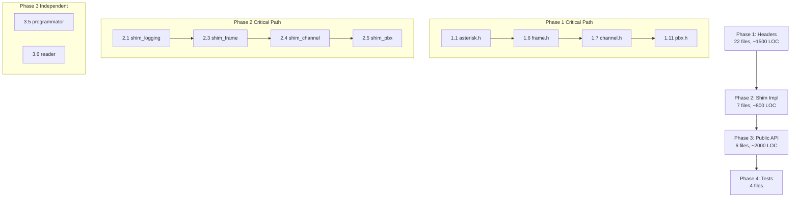

# Plan: asterisk-chan-simbox

> Version: 1.2
> Status: REOPENED — Phase 0 and Phase 5 (new) pending approval, Phases 1-4 still valid
> Last Updated: 2026-08-22

## Implementation Strategy

**Approach**: Bottom-up, shim headers first → compile test → adapters → public API.

**Amendment 2026-08-22**: Phases 1-4 below were executed and Phases 1-2
(the shim) are confirmed real and working. Phase 3 ("Public C API &
Adapters") was *delivered* but not as *specified* — its tasks (3.3-3.6)
were supposed to depend on and drive Phase 2's shim (see original task
table's Depends column: 3.3 depends on 2.4/2.5), but the delivered code
never calls into chan_svistok at all — see
`01-requirements.md`'s Amendment and `02-specifications.md` §9 for the
full finding. New **Phase 5** below is the rework: same target files as
Phase 3, but actually wired per §9's design. Phase 3's task table is
left unchanged below as a historical record of what was *asked for*
(which was correct) — Phase 5 is what's needed to actually *deliver*
it.

**Correction 2026-08-22 (same day)**: Phase 5's first draft proposed
adding `EXPORT_DEF` to five functions inside the read-only
`asterisk_chan_svistok/` tree. Anton rejected this directly — the
read-only rule has no exceptions. Phase 5 below is rewritten to reach
chan_svistok exclusively through symbols it already exports
(`channel_tech`, `gpublic`, `at_enque_*`, etc. — see specifications §9)
plus one adapter-side mechanism (`AST_MODULE_INFO` macro capture,
entirely inside `adapters/`) to reach `load_module`. **Zero
modifications to either read-only tree anywhere in this plan.**
Also new: **Phase 0**, inserted *first* — establishing chan_svistok's
own existing tests as a verified baseline — and Phase 5's final task
(5.9) — copying those same tests, unmodified, into `tests/` as the
closing proof the adapter forwards correctly. Both added per Anton's
explicit instruction that test coverage bookends this whole effort.

The plan is sequenced so that each task produces a testable artifact.
The critical path is: **chan_svistok test baseline** → headers → compile
→ link → public API (real, adapter-driven) → **copy chan_svistok's
tests through the adapter**.

---

### Phase 0: chan_svistok Test Baseline (do this first, before any adapter code)
*Goal: a verified, known-good record of chan_svistok's own behavior,
established via its own existing tests — the reference point every
later phase's "does the adapter forward correctly" question gets
checked against.*

| # | Task | Files | Complexity | Depends |
|---|------|-------|-----------|---------|
| 0.1 | Inventory chan_svistok's existing test files: `chan_svistok/test/test1.c` (mixbuffer/ringbuffer — pure logic, no I/O), `chan_svistok/simnode/adiscovery_test.c`, `chan_svistok/programmator/ttyprog_test.c`, `chan_svistok/reader/old/test.c` (542 lines — largest, likely needs a real/simulated reader device). Document what each actually exercises and what it needs to build/run (real hardware vs. pure logic). | (read-only, inventory only) | S | — |
| 0.2 | Build a **new** harness (in `tests/`, not touching the read-only tree) that compiles and runs each file *as-is* against chan_svistok directly — not through any shim, not through Asterisk either, just whatever minimal driver each test file itself needs (test1.c looks self-contained per its `#include "mixbuffer.h"`/`"helpers.h"`; the others need checking per 0.1). | `tests/baseline/Makefile`, `tests/baseline/*` (harness only, test files stay untouched, referenced by path) | M | 0.1 |
| 0.3 | Run the harness, record results as the baseline (pass/fail/skip-needs-hardware per file) in `04-implementation-log.md` — this record is what Phase 5.9's final copy-and-rerun gets compared against. | `04-implementation-log.md` | S | 0.2 |

**Phase 0 exit criteria**: every one of chan_svistok's existing test
files has run at least once in this flow's environment, with results
recorded, before any adapter/API code (Phase 5) is written.

---

---

## Task Breakdown

### Phase 1: Shim Headers (Trivial Layer)
*Goal: chan_svistok source compiles with `-I adapters/include/`*

| # | Task | Files | Complexity | Depends |
|---|------|-------|-----------|---------|
| 1.1 | Create `adapters/include/asterisk/asterisk.h` — master include, `ASTERISK_FILE_VERSION` no-op, version defines | 1 file | S | — |
| 1.2 | Create `asterisk/utils.h` — `ast_free`, `ast_malloc`, `ast_strdup`, `ast_strdupa`, `ast_alloca`, `ast_strlen_zero`, `ast_pthread_create_background` | 1 file | S | — |
| 1.3 | Create `asterisk/logger.h` — `ast_log`, `ast_verb`, `ast_debug`, `LOG_*` levels | 1 file | S | — |
| 1.4 | Create `asterisk/strings.h` — `ast_str`, `ast_str_buffer`, `ast_str_strlen` | 1 file | S | — |
| 1.5 | Create `asterisk/linkedlists.h` — `AST_LIST_*`, `AST_RWLIST_*` macros | 1 file | M | — |
| 1.6 | Create `asterisk/frame.h` — `struct ast_frame`, frame types, `AST_FRAME_*`, `ast_frfree`, `ast_frisolate` | 1 file | M | — |
| 1.7 | Create `asterisk/channel.h` — `struct ast_channel` (opaque), `struct ast_channel_tech`, accessors | 1 file | L | 1.6 |
| 1.8 | Create `asterisk/format_cap.h` — `ast_format_cap_*` stubs (SLINEAR-only) | 1 file | S | — |
| 1.9 | Create `asterisk/cli.h` — `struct ast_cli_entry`, `struct ast_cli_args`, `AST_CLI_DEFINE`, `ast_cli` | 1 file | M | — |
| 1.10 | Create `asterisk/module.h` — `AST_MODULE_INFO` no-op, `AST_MODFLAG_DEFAULT`, `ASTERISK_GPL_KEY` | 1 file | S | — |
| 1.11 | Create `asterisk/pbx.h` — `ast_pbx_start` stub, `pbx_builtin_setvar_helper` | 1 file | S | 1.7 |
| 1.12 | Create `asterisk/timing.h` — `ast_timer_*` types and function declarations | 1 file | S | — |
| 1.13 | Create `asterisk/causes.h` — `AST_CAUSE_*` constants | 1 file | S | — |
| 1.14 | Create `asterisk/callerid.h` — `AST_PRES_*` constants, `ast_callerid_parse` | 1 file | S | — |
| 1.15 | Create `asterisk/dsp.h` — DSP types for chan_svistok's own dsp.c | 1 file | M | 1.6 |
| 1.16 | Create `asterisk/config.h` — `ast_variable_browse` stub | 1 file | S | — |
| 1.17 | Create `asterisk/manager.h` — `ast_manager_register2`/`unregister` stubs | 1 file | S | — |
| 1.18 | Create `asterisk/musiconhold.h` — `ast_moh_start`/`stop` no-ops | 1 file | S | — |
| 1.19 | Create `asterisk/stringfields.h` — `AST_DECLARE_STRING_FIELDS` macros | 1 file | L | — |
| 1.20 | Create `asterisk/options.h`, `asterisk/ast_version.h`, `asterisk/ulaw.h`, `asterisk/alaw.h` — small stubs and lookup tables | 4 files | M | — |

**Phase 1 total**: 22+ header files, ~1500 lines estimated.
**Exit criteria**: `gcc -I adapters/include/ -fsyntax-only chan_svistok/*.c` compiles with zero errors.

---

### Phase 2: Shim Implementations (Real Logic)
*Goal: chan_svistok source links into a shared library*

| # | Task | Files | Complexity | Depends |
|---|------|-------|-----------|---------|
| 2.1 | Implement `shim_logging.c` — configurable log callback, default stderr routing | adapters/src/shim_logging.c | S | 1.3 |
| 2.2 | Implement `shim_timer.c` — `timerfd_create`/`timerfd_settime` wrappers for `ast_timer_*` | adapters/src/shim_timer.c | M | 1.12 |
| 2.3 | Implement `shim_frame.c` — `ast_frfree`, `ast_frisolate`, `ast_queue_frame` with consumer callback | adapters/src/shim_frame.c | M | 1.6 |
| 2.4 | Implement `shim_channel.c` — `ast_channel` lifecycle, accessors, channel variable storage, `ast_waitfor_n_fd` via `poll()` | adapters/src/shim_channel.c | L | 1.7, 2.3 |
| 2.5 | Implement `shim_pbx.c` — `ast_pbx_start` as event dispatch, `pbx_builtin_setvar_helper` key-value store | adapters/src/shim_pbx.c | M | 1.11, 2.4 |
| 2.6 | Implement `shim_cli.c` — `ast_cli` output routing, `ast_cli_register_multiple` storage | adapters/src/shim_cli.c | S | 1.9 |
| 2.7 | Implement `shim_callerid.c` — minimal `ast_callerid_parse` (~20 lines) | adapters/src/shim_callerid.c | S | 1.14 |
| 2.8 | Create `adapters/Makefile` — build all shim sources into `libsimbox_shim.a` | adapters/Makefile | M | 2.1–2.7 |

**Phase 2 total**: 7 .c files + Makefile, ~800 lines estimated.
**Exit criteria**: `chan_svistok/*.c` + `adapters/src/*.c` link into `libsimbox_shim.a` without undefined symbols.

---

### Phase 3: Public C API & Adapters
*Goal: `libsimbox.so` with clean FFI-ready API*

| # | Task | Files | Complexity | Depends |
|---|------|-------|-----------|---------|
| 3.1 | Create `src/simbox_types.h` — public enums, opaque handle types, event types | src/simbox_types.h | M | — |
| 3.2 | Create `src/simbox_api.h` — full public C API declaration (per spec §5) | src/simbox_api.h | M | 3.1 |
| 3.3 | Implement `src/simbox_modem.c` — modem driver adapter: init, device enumeration, calls, SMS, USSD, AT commands, event callback dispatch | src/simbox_modem.c | XL | 2.4, 2.5 |
| 3.4 | Implement `src/simbox_discovery.c` — discovery adapter wrapping adiscovery_core | src/simbox_discovery.c | L | 2.8 |
| 3.5 | Implement `src/simbox_programmator.c` — programmator adapter wrapping ttyprog_* | src/simbox_programmator.c | M | — |
| 3.6 | Implement `src/simbox_reader.c` — reader adapter wrapping reader_core | src/simbox_reader.c | M | — |
| 3.7 | Create `src/Makefile` — build `libsimbox.so` from all sources | src/Makefile | M | 3.3–3.6 |

**Phase 3 total**: 6 files + Makefile, ~2000 lines estimated.
**Exit criteria**: `libsimbox.so` exports all `simbox_*` symbols, loads without errors.

---

### Phase 4: Integration Testing
*Goal: Prove the shim works with a real modem*

| # | Task | Files | Complexity | Depends |
|---|------|-------|-----------|---------|
| 4.1 | Create `tests/test_compile.sh` — compile chan_svistok via both paths (real Asterisk headers vs shim) | tests/ | S | 2.8 |
| 4.2 | Create `tests/test_discovery.c` — standalone discovery with simbox API | tests/ | M | 3.4 |
| 4.3 | Create `tests/test_modem.c` — basic modem init + device enumerate | tests/ | M | 3.3 |
| 4.4 | Create `tests/test_sms.c` — send SMS via simbox API | tests/ | M | 3.3 |

**Phase 4 total**: 4 test files.
**Exit criteria**: Tests pass on a system with at least 1 Huawei modem.

---

## Dependency Graph

## Complexity Legend

| Size | Estimated LOC | Estimated Time |
|------|--------------|---------------|
| S | < 50 | < 30 min |
| M | 50–200 | 30 min – 2h |
| L | 200–500 | 2h – 4h |
| XL | 500+ | 4h+ |

## Total Estimates

| Phase | Tasks | Est. LOC | Est. Time |
|-------|-------|----------|-----------|
| Phase 1: Headers | 20 | ~1500 | 1–2 days |
| Phase 2: Shim Impl | 8 | ~800 | 1–2 days |
| Phase 3: Public API | 7 | ~2000 | 2–3 days |
| Phase 4: Tests | 4 | ~300 | 1 day |
| **Total** | **39** | **~4600** | **5–8 days** |

---

### Phase 5: Real Adapter Wiring (Amendment 2026-08-22, corrected twice)
*Goal: `src/simbox_*.c` actually drives chan_svistok's real logic,
reached exclusively through already-exported symbols or adapter-side
capture — see specifications §9 for the grounded design each task below
implements. **Zero modifications to `asterisk_chan_svistok/` or
`asterisk_chan_dongle/` anywhere in this phase.***

**Platform split (2nd correction, same day, see specifications §9's
matching note)**: chan_svistok is Linux-only by design — Task 5.2
verification found its real code (background discovery thread) doesn't
run on macOS, confirming this isn't optional. From Task 5.3 on, every
function this phase adds to `src/simbox_*.c` needs an
`#ifdef __linux__` real branch (per §9.1-9.5) and a stub `#else` branch
(non-Linux, matches the existing stub-first default) — not a single
unconditional implementation. This session's dev machine is macOS, so
the Linux branch can be compile-checked here but only exercised for
real on an actual Linux environment — flag this limitation honestly in
each task's verification notes rather than claiming full confidence
without it.

| # | Task | Files | Complexity | Depends |
|---|------|-------|-----------|---------|
| 5.1 | `EXPORT_DEF`/`EXPORT_DECL` symbol audit (requirements' Must-Have #9, specifications §9.7): full `grep -n "EXPORT_DEF\|EXPORT_DECL"` pass across all 20 chan_svistok files, tabulated with what each symbol is and whether the adapter needs it. Design input for every task below — do this first, not alongside. | (new table in `02-specifications.md` §9.7, or a new doc) | S | Phase 0 |
| 5.2 | New `adapters/src/shim_module_registry.c` + a small change to `adapters/include/asterisk/module.h`'s `AST_MODULE_INFO` macro expansion (adapter-side only) so chan_dongle.c's unmodified `AST_MODULE_INFO(...)` invocation also registers the resulting `ast_module_info` (and therefore its `.load`/`.unload`/`.reload` pointers) somewhere `src/simbox_api.c` can retrieve it. This is the one piece of new "прокидка" plumbing this phase needs — entirely inside `adapters/`. | `adapters/include/asterisk/module.h`, new `adapters/src/shim_module_registry.c` | M | 5.1 |
| 5.3 | `simbox_init()` calls the captured `load()` (via 5.2) once, triggering chan_dongle's real, unmodified, config-file-driven device population (`load_module` → `public_state_init(gpublic)` → `pvt_create()` per device). `simbox_device_t` becomes a thin wrapper around a real `struct pvt *` read from the already-exported `gpublic->devices` list — retire `struct simbox_device_internal` entirely. Retire `simbox_device_register()`'s fabricated-struct path (added by `sdd-flutter_gsm-ffi`'s Task 1.1) — coordinate with that flow first, since its test helper `debugRegisterDiscoveredDevice` calls it directly. | `src/simbox_api.c`, `src/simbox_modem.c` | L | 5.2 |
| 5.4 | `simbox_device_count`/`get_by_index`/`get_by_sn` walk `gpublic->devices` directly via the already-shimmed `AST_RWLIST_TRAVERSE` macro, replacing the fabricated array. | `src/simbox_api.c` | M | 5.3 |
| 5.5 | Wire `simbox_call_originate`/`simbox_call_hangup`/`simbox_call_answer` to the already-exported `channel_tech.requester`/`.call`/`.hangup`/`.answer` function pointers, per specifications §9.2. Cache the `ast_channel*` per device for the matching hangup/answer calls. | `src/simbox_modem.c` | L | 5.3 |
| 5.6 | Wire `simbox_sms_send`/`simbox_ussd_send`/`simbox_at_command` to the already-exported `at_enque_sms`/`at_enque_ussd`/`at_enque_cmd_proc`, per specifications §9.3. Includes resolving the `cpvt` acquisition question flagged there (no active call context) and the synchronous-wrapper-around-async-response design for `simbox_at_command`. | `src/simbox_modem.c` | XL | 5.3 |
| 5.7 | Investigate and wire IMEI change (specifications §9.4 — likely redirects to `simbox_prog_change_imei` rather than an AT-command path; not yet confirmed). | `src/simbox_modem.c` or `src/simbox_programmator.c` | M | 5.6 |
| 5.8 | Wire real event firing through `shim_pbx.c` (calls) and investigate `at_response.c`'s completion path for SMS/USSD-response events, per specifications §9.5. Apply the heap-allocate-and-transfer-ownership convention (`simbox_types.h`'s `simbox_event_cb` doc comment) to every new firing site. | `adapters/src/shim_pbx.c`, `src/simbox_api.c` | L | 5.5, 5.6 |
| 5.9 | Add the mechanical check from requirements' Must-Have #8: a `grep`-based test (fails if `src/*.c` stops referencing `channel_tech`/`at_enque_*`/`gpublic`/etc.) plus a `socat`-PTY-pair smoke test showing real AT bytes crossing the wire for at least `simbox_at_command`. | `tests/test_simbox.c`, new `tests/test_real_wiring.sh` | M | 5.5, 5.6 |
| 5.10 | Full regression: existing `tests/test_simbox.c` suites 1-6 (5 original + `sdd-flutter_gsm-ffi`'s Test 6 registry-wiring addition) must still pass; `flutter_gsm`'s `SimboxModemRepository` tests (`test/simbox_modem_repository_test.dart`) must still pass unmodified, or any breakage reported back to that flow explicitly, not silently patched around here. | — (verification-only) | M | 5.1-5.9 |
| 5.11 | **(requirements' Must-Have #10, final task)** Copy chan_svistok's own test files (`chan_svistok/test/test1.c`, `chan_svistok/simnode/adiscovery_test.c`, `chan_svistok/programmator/ttyprog_test.c`, `chan_svistok/reader/old/test.c`) **verbatim, unmodified**, into `libsCpp/asterisk_chan_simbox/tests/`. Build and run them against the now-real adapter/shim path. Compare results against Phase 0's baseline recording — passing unmodified is the closing proof that forwarding preserves chan_svistok's real, verified behavior. | new `tests/copied/*` (verbatim copies), `tests/Makefile` | M | 5.10 |

**Phase 5 total**: ~8-10 files touched/added, **zero** changes to either
read-only tree. Estimated complexity is meaningfully higher than Phase
3's original XL/L estimates suggested, precisely because Phase 3's
delivered version skipped the hard part (real chan_svistok integration)
that Phase 5 now has to actually do.
**Exit criteria**: Must-Have #8's grep check passes; the `socat` smoke
test shows real AT bytes; Phase 5.10's regression suites green; Phase
5.11's copied chan_svistok tests pass unmodified through the adapter.

---

## Risk Register

| Risk | Impact | Mitigation |
|------|--------|-----------|
| `stringfields.h` macros more complex than estimated | Phase 1 delay | Study Asterisk source first; fallback: minimal subset |
| chan_svistok `dsp.c` has hidden Asterisk deps beyond types | Phase 2 blocker | Compile test early (Phase 1 exit criteria) |
| `ast_channel` struct layout assumptions in chan_svistok | Phase 2 blocker | Verify all access is through accessors, not direct fields |
| Programmator/reader have undocumented tty_v2.c dependencies | Phase 3 delay | Already standalone — low risk |
| **(New)** `cpvt`/`pvt` acquisition for SMS/USSD outside an active call context isn't yet traced — chan_svistok's normal flow always has a `cpvt` from an in-progress `ast_channel` | Phase 5.6 blocker | Read `cpvt.c` in full at implementation time before writing 5.6; worst case, originate a lightweight internal pseudo-channel per device to always have a `cpvt` on hand |
| **(New)** Same failure mode recurs — Phase 5 delivered as another disconnected simulation | Would fully defeat this amendment's purpose | Must-Have #8's grep check + socat smoke test (5.9) + Phase 5.11's copied-test parity check are the concrete guardrails; do not mark Phase 5 complete without all three passing, not just "compiles and returns 0" |
| **(New)** `AST_MODULE_INFO` macro-capture trick (5.2) turns out insufficient to reach `load_module` safely (e.g. ordering/threading issues in `chan_dongle.c`'s own init sequence) | Phase 5.3 blocker | Fall back to a narrower adapter-side reimplementation of *just* the device-population loop (still calling `pvt_create` indirectly is impossible if it stays unreachable — in that fallback case, escalate back to Anton for a decision rather than silently reaching for a read-only-tree change again |
| **(New)** Phase 0's baseline tests need real/simulated hardware (e.g. `reader/old/test.c`, 542 lines) that isn't available in this environment | Phase 0 delay, weakens the baseline | Record as skip-needs-hardware in the baseline (0.3), not a failure — Phase 5.11's final parity check inherits the same limitation honestly rather than pretending full coverage |

---

## Approval

- [x] Reviewed by: Anton Dodonov
- [ ] Approved on: _____ (original Phases 1-4)
- [x] Reviewed by: Anton Dodonov — corrected Phase 5's first draft
      directly (rejected the read-only-tree `EXPORT_DEF` exception;
      redirected to already-exported-symbol + `AST_MODULE_INFO`-capture
      design; added Phase 0 test baseline first and Phase 5.11
      copy-tests-verbatim as the closing step)
- [x] Approved on: 2026-08-22 (Phase 0 + Phase 5 amendment, corrected
      version)
- [ ] Notes:
